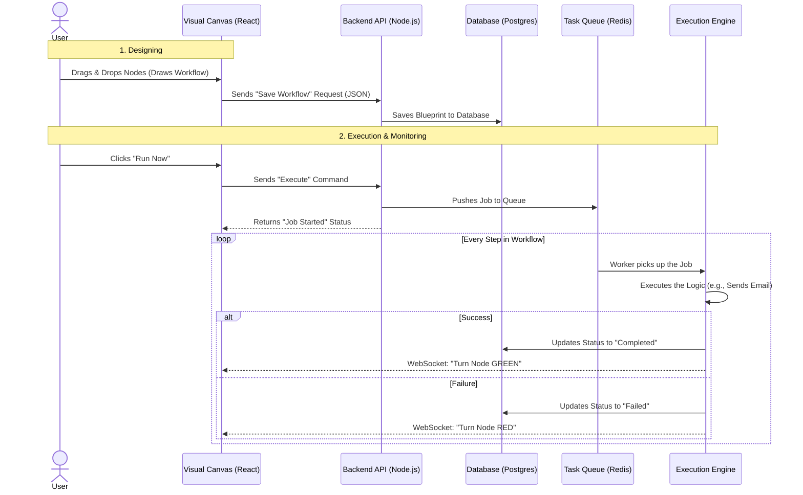

# Real-Time Workflow Management Platform

## What does this application do?

In simple words, this application is like a **programmable robot manager** for your business.

1.  **The "Map" (Design):** You go to the website and draw a map of what you want to happen. You don't write code; you just drag blocks on the screen.
    *   *Example:* You drag a "Start" block, connect it to a "Send Email" block, and connect that to a "Save to Database" block.
2.  **The "Robot" (Execution):** When you click "Run" (or when a specific event happens, like a new user signing up), a digital robot picks up your map and follows the instructions exactly.
3.  **The "Live View" (Monitoring):** You can watch the robot work in real-time. As it finishes the "Send Email" step, that block turns **Green** on your screen. If the internet goes down and it can't save to the database, that block turns **Red**, so you know exactly where it got stuck.

## System Workflow (UML)

The following diagram illustrates how the components talk to each other when a user runs a workflow.

